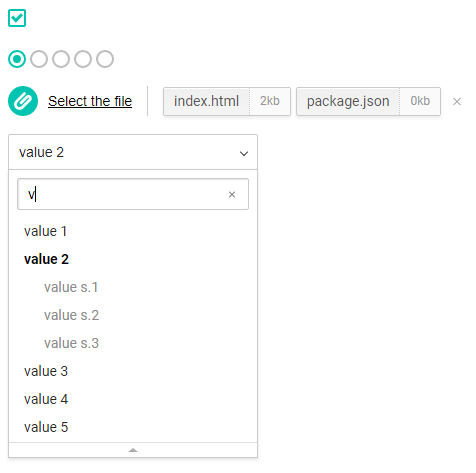

# Input decorator

## How to use

html:

	just add attribute "data-inputdecor" and use settings as "data-" attributes.  

JavaScript:

    $(selector).inputDecor(settings)
	
Also script has its own API with which you can affect the individual elements and group:
	
    $.inputDecor(selector).method()
    
Example:

```js
$.inputDecor('#target').find("option 1");
```

## File settings

| setting     |  attribute       |  description                                    | default                  | 
|-------------|:-----------------|-------------------------------------------------|:------------------------:|
| placeholder | data-placeholder | adds text to button                             | "Select the file"        |
| unselected  | data-unselected  | adds unselected text                            |  "-- is not selected --" |
| className   | data-class       |  add class to wrapper                           |  none                    |
| clear       | data-clear       |  adds button wich clear the selection           |  true                    |
| size        | data-size        |  show sizes of the files                        |  false                   |
| maxCount    | data-max-count   |  defines max files count on multyfile mode      |  3                       |
| types       | data-types       |  adds a list of available file types            |  false                   |
| fileList    | data-file-list   |  displays the selected files in a separate list |  false                   |
| drop        | data-drop        |  *in developing...*                             |  false                   |

multifile mode is activated as well as in native html

```html
	<input type="file" name="file" multiple
		data-inputdecor
		data-placeholder="Choose"
		data-size
		data-file-list
		data-max-count="5"
		data-types="gif, jpg, png"
	>
```
```js
	$("#some-file").inputDecor({
		placeholder : "Choose",
		fileList    : true,
		size        : true,
		maxCount    : 5,
		types       : [ "pdf", "txt", "doc", "docx" ]
	});
```

**API Methods:**
- **clear()** - clears list of added files

## Checkbox settings

have not special options, but support standart attribute checked

**API Methods:**
- **activate()** - activate checkbox
- **deactivate()** - deactivate checkbox
- **toogle()** - toogle checkbox

## Radio settings

| setting |  attribute  |  description               | default | 
|---------|:------------|----------------------------|:-------:|
| remove  | data-remove | allows to deactivate radio | false   |

    support standart attribute checked

```html
<input data-inputdecor type="radio" name="choose" checked value="1">
<input data-inputdecor type="radio" name="choose" value="2" data-remove >
<input data-inputdecor type="radio" name="choose" value="3">
```

**API Methods:**
- **activate()** - activate radio
- **deactivate()** - deactivate radio
- **toogle()** - toogle radio

## Select settings

| setting      |  attribute        |  description                        | default        | 
|--------------|:------------------|-------------------------------------|:--------------:|
| speed        | data-speed        | animation time in milliseconds      | 250            |
| rollup       | data-rollup       | adds button which collapse the list | false          |
| className    | data-class        | adds class to the wrapper           | none           |
| selectIndex  | data-select-index | index of the selected option        | 250            |
| unselected   | data-unselected   | adds unselected element to the list | false          |
| placeholder  | data-placeholder  | defines text to the button          | "Select value" |

Select decorator also support grouping options ( It work only for "ul" elements ).  
Also you can use standart attribute "selected" in option instead "selectIndex" setting.  
As the unselected parameter, you can pass true or a string with text to replace the default value

**Searching settings:**

| setting    |  attribute           |  description                                              | default           | 
|------------|:--------------------:|:----------------------------------------------------------|:-----------------:|
| textEmpty  | data-search-empty    | define text to "not found" element                        | "-- not found --" |
| inButton   | data-search-inbutton | append the search input instead the button                | false             |
| caseSense  | data-search-case     | configure case sensitivity searching                      | false             |
| wholeWord  | data-search-whole    | configure whole word searching                            | false             |
| beginWord  | data-search-begin    | configure searching by only first characters in the words | false             |

In order to activate the search in the list you need to specify the appropriate setting "search".  
If you specify "true", the search will use the default settings or you need to specify an object with settings instead of "true

**Callbacks:**

- **onChoose** - callback on choose in the list (data-on-choose)
- **onReady** - callback on ready the list (data-on-ready)
 
**API Methods:**

- **choose( index )** - choose option by index in the list
- **open()** - open the list
- **close()** - close the list
- **toogle()** - toogle the list
- **find( value )** - find the value in the list
- **count()** - returns count of options in the list
- **addOption( { value, (html | text), childs } )** - append option to the list.

```html
<select
	data-inputdecor
	data-rollup
	data-unselected
	data-on-choose="console.log(e)"
	data-placeholder="Select from the list"
	data-unselected="-- unselected --"
>
	<option value="1">value 1</option>
	<option value="2">value 2</option>
	<option value="3" selected >value 3</option>
</select>

<!--
	ALSO YOU CAN USE
	
	<ul data-inputdecor data-attributes ... >
		<li value="1" ><a href="#">value 1</a></li>
		<li value="2" selected ><a href="#">value 2</a></li>
		...
		<li value="N" data-group="title or link" [value] >
			<ul>
				<li value="N.1"><a href="#">value N.1</a></li>
				<li value="N.2"><a href="#">value N.2</a></li>
				<li value="N.3"><a href="#">value N.3</a></li>
			</ul>
		</li>
	</ul>
	-->
```
```js
$(".some").inputDecor("select", {
	unselected : true,
	rollup : true,
	search : {
		inButton  : true,
		beginWord : true
	},
	onChoose : function(e) {
		console.log(e);
	}
});

var target = $.inputDecor('#target'),
	count = target.count();

target.addOption({
	html   : "<a href='#'>option " + count + "</a>",
	childs : [{
		html   : "<a href='#'>option " + count +".1</a>",
		text   : "test_1",
		value  : 1,
	}, {
		html   : "<a href='#'>option " + count +".2</a>",
		text   : "test_2",
		value  : 2,
	}]
});
```

## Result



-------------
Thank's for using.  
Developed by **Ustinov Maxim** - [ewclide](http://vk.com/ewclide)