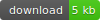

# InputDecor.js

 [][1]

### Description

Allows to decorate input elements on the page  
**It works without jquery.**

### How to use

**html:**

Just add attribute **"data-inputdecor"** and use settings as **"data-"** attributes.

```html
<input type="radio" name="use_it" data-inputdecor data-remove >
```

**JavaScript:**

Create new elements with special class (id).
```js
var elemDecor = new InputDecor(".special", settings);

/**
you can pass document element for create single instance
*/
var elemDecor = new InputDecor(document.getElementById("someId"), settings);

```

**Common API:**

- isInputDecorList - *true*
- **invoke** (method, arguments[])
- **getById** (id)
- **static getById** (id)

**Using common API:**  

Via static method **getById** you can get instance from all decorated elements on the page include elements created with "data-inputdecor" attributes.
```js
var elemDecor = InputDecor.getById(id); // id of the element
```

But if you create elements in javascript via className that InputDecor create list of appropriate elements.  
For affect any element from this list, you must get it using **getById** method.
```js
var elemDecor = new InputDecor(".some-list"),

if (elemDecor.isInputDecorList)
	elemDecor = elemDecor.getById("target");
```

Also you can affect group of elements using invoke method.  
The first parameter is name of the method, the second (optional) is arguments:
```js	
var elemDecor = new InputDecor(".some-list");
	elemDecor.invoke("select", ["main", 1]);
```
-------
### File settings

| setting     | attribute         | description                                     | default                  | 
|:------------|:------------------|:------------------------------------------------|:-------------------------|
| placeholder | data-placeholder  | adds text to button                             | "Select the file"        |
| unselected  | data-unselected   | adds unselected text                            |  "-- is not selected --" |
| className   | data-class        | add class to wrapper                            |  none                    |
| clear       | data-clear        | adds button wich clear the selection            |  true                    |
| size        | data-size         | show sizes of the files                         |  false                   |
| maxCount    | data-max-count    | defines max files count on multyfile mode       |  3                       |
| charSize    | data-char-size    | defines max length of file name                 |  12                      |
| types       | data-types        | adds a list of available file types             |  false                   |
| fileList    | data-file-list    | displays the selected files in a separate list  |  false                   |
| drop        | data-drop         | *in developing...*                              |  false                   |
| errMaxCount | data-err-maxcount | defines text of the "max count" error           |  "Max count of files - " |
| errTypes    | data-err-types    | defines text of the "permissible types" error   |  "You can only select files of types - " |

multifile mode is activated as well as in native html  

**Examples:**

```html
	<input type="file" name="file"
		data-inputdecor
		data-size
		data-types="gif, jpg, png"
		multiple
	>
```
```js
	var fileInput = new InputDecor({
		types : [ "pdf", "txt", "doc", "docx" ]
	});
```

**Provided API:**  

- isInputDecor - *true*
- **clearList** () - *clears list of added files*

-------
### Checkbox settings

have not special options, but support standart attribute **"checked"**.

**Provided API:**  

- name
- checked
- value
- isInputDecor - *true*
- **switchOn** ()
- **switchOff** ()
- **toggle** ()

-------
### Radio settings

| setting | attribute   | description                | default | 
|---------|:------------|:---------------------------|:-------:|
| remove  | data-remove | allows to deactivate radio | false   |

support standart attribute **"checked"**.

```html
<input data-inputdecor type="radio" name="choose" value="1" checked >
<input data-inputdecor type="radio" name="choose" value="2" data-remove >
<input data-inputdecor type="radio" name="choose" value="3" >
```

**Provided API:**  

- name
- checked
- value
- isInputDecor - *true*
- **switchOn** ()
- **switchOff** ()
- **toggle** ()

-------
### Select settings

**Common settings:**

| setting      | attribute         | description                                 | default              |
|:-------------|:------------------|:--------------------------------------------|:---------------------|
| maxHeight    | max-height        |  max height of expanded list                | 250                  |
| rollup       | data-rollup       | button which collapse the list              | false                |
| className    | data-class        | class to the wrapper                        | none                 |
| index        | data-index        | index of the selected option                | -1                   |
| nodeIndex    | data-node-index   | index of the node option in group           | none                 |
| value        | data-value        | value of the selected option                | none                 |
| unselected   | data-unselected   | unselected element in the list              | true & "-- not selected --" |
| textEmpty    | data-text-empty   | text when the select list is empty          | "Nothing to choose"  |
| placeholder  | data-placeholder  | text when elements is unselected            | "Select value"       |
| zIndex       | data-zindex       | z-index of the element                      | 1                    |
| search       | data-search       | activates search                            | false                |
| onChange     | data-on-change    | function wich invokes when select the value | false                |
| onReady      | data-on-ready     | function wich invokes when element is ready | false                |
 
**Search settings:**

| setting    | attribute            | description                                     | default           | 
|:-----------|:---------------------|:------------------------------------------------|:------------------|
| textEmpty  | data-search-empty    | text of not-found element                       | "-- not found --" |
| inButton   | data-search-inbutton | search input appends to the button place        | false             |
| caseSense  | data-search-case     | case sensitivity searching                      | false             |
| wholeWord  | data-search-whole    | whole word searching                            | false             |
| beginWord  | data-search-begin    | searching by only first characters in the words | false             |

For unselected parameter you can pass boolean (true - shows, false - hides) or string value.  
You can use standart attribute **"selected"** in option instead **"data-index"**.  
Two identical options are shown below.
```html
<select name="target" data-inputdecor data-index="2">
	<option value="value 1">option 1</option>
	<option value="value 2">option 2</option>
	<option value="value 3" selected >option 3</option>
</select>
```

If the index is unknown in advance, you can use the value setting.
```html
<select name="target" data-inputdecor data-value="some-value">
	<!-- options -->
</select>
```

It also support decoration **"ul"** elements - wich allows to use html content in option elements.  
Or use html content when add option in javascript.

```html
<ul data-inputdecor >
	<li value="value 1">
		<a href="/url-1">option 1</a>
	</li>
	<li value="value 2">
		<a href="/url-2">option 2</a>
	</li>
	<li value="value 3">
		<a href="/url-3">option 3</a>
	</li>
</ul>
```

```js
var selectDecor = new InputDecor("#someId");
	selectDecor.addOption({
		text  : "option 1",
		html  : "<a href='/url-1'>option 1</a>",
		value : "value 1"
	});
```

**Grouping:**

For grouping options just add **"data-group"** and **"data-child"** attributes  
or use **"group"** and **"child"** settings, when add options via javascript.   

```html
<option value="value 1" data-group="main">option 1</option>
	<option value="value 1.1" data-child="main">option 1.1</option>
	<option value="value 1.2" data-child="main">option 1.2</option>
	<option value="value 1.3" data-child="main">option 1.3</option>
<option value="value 2">option 2</option>
```

```js
selectDecor.addOption([
	{
		text  : "option 1",
		value : "value 1",
		group : "main"
	},
	{
		text  : "option 1.1",
		value : "value 1.1",
		child : "main"
	},
	{
		text  : "option 1.2",
		value : "value 1.2",
		child : "main"
	}
]);
```

**Searching:**

In order to activate search in the list you must to specify appropriate setting **"search"**.  
If you specify **"true"**, the search will use default settings or specify an object with settings instead of boolean value.

```html
<select
	id="target"
	name="target"
	data-inputdecor
	data-search
	data-search-inbutton
>
	<option value="value 1">option 1</option>
	<option value="value 2">option 2</option>
	<option value="value 3">option 3</option>
</select>
```

```js
/** use default settings */
var some = new InputDecor("#someId", {
	search : true
});

/** or define your settings */
var some = new InputDecor("#someId", {
    search : {
        textEmpty : "-- nothing founded --",
        inButton  : true,
        beginWord : true
    }
})
```

**Provided API:**  

- length - *count of main options or groups without child nodes*
- wholeLength - *count of all options*
- index - *index of main option or group*
- nodeIndex - *index of child option*
- value - *selected value*
- isInputDecor - *true*
- **find** (value)
- **select** (index or groupName, nodeIndex)
- **selectByValue** (value) - *similar to "data-value" attribute or "value" setting*
- **addOption** (optionsArray or { text, html, value, group, child })
- **removeOption** (index)
- **clearGroup** (groupName) - *removes all child nodes from the group*
- **clearOptions** () - *removes all options from the list*
- **open** ()
- **close** ()
- **toggle** ()

**Examples of using:**  
```js
/** simple select */
selectDecor.select(1);

/** select node in the group */
selectDecor.select(1, 3);

/** or use group name */
selectDecor.select("main", 3);

/** for use unselected state */
selectDecor.select(-1);

selectDecor.selectByValue("some option");

selectDecor.addOption({
	text  : "option 1",
	html  : "<a href="/url-1">option 1</a>",
	value : "value 2",
	/**
	group : name,
	or
	child : name
	*/
});
```

### Result


-------------
Thank's for using.  
Developed by Ustinov Maxim - ewclide

[1]: https://github.com/ewclide/inputdecor/archive/v2.0.zip  "download"