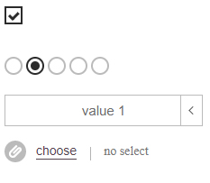

#Roll Input Decorator
-------------

### Description

	allows to decorate input elements

### Agruments

**File**
- text-button - add user text to button
- text-unselected - defines unselected text
- class - add your class to wrapper
- close - add close button
- size - shows sizes of the files
- max-count - defines max files count on multyfile mode
- drop - need to develop...

**Checkbox**
- have not special options, but support standart attribute checked

**Radio**
- remove - allows to deactivate radio
- support standart attribute checked

**Select**
- speed - defines speed of rolling animation
- rollup - defines speed of rolling animation
- unselected - add unselected value to the list
- unselectedText - text of unselected option
- selectedIndex - index of select value
- class - add your class to wrapper
- onchange - allows to define the onchange callback
- buttonText - text on button

	**WARNING!**
	select input also can use on html list "<ul><li><a href=''>Text</a></li></ul>"
	li elements will save their attributes

### How to use

	create div element with class "inputdecor" and define attributes wich must begin from "data-" + option

### Examples

```html
	<input type="checkbox" class="inputdecor">
	<input type="radio" name="radio" class="inputdecor" value="2" data-remove="false">
	<select class="inputdecor"
		data-rollup="true"
		data-unselected="true"
		data-onchange="change"
		data-class="myclass"
		data-text="select from"
		data-unselected-text="unselected"
	>
		<option value="1" selected>value 1</option>
		<option value="2">value 2</option>
		<option value="3">value 3</option>
		<option value="4">value 4</option>
		<option value="5">value 5</option>
	</select>

	<!--

	ALSO YOU CAN USE

	<ul class="inputdecor" data-attributes ... >
		<li value="value 1" selected><a href="#">value 1</a></li>
		...
		<li value="value 5"><a href="#">value N</a></li>
	</ul>

	-->

	<input type="file" name="file" class="inputdecor" multiple
		data-text-button="choose"
		data-text-unselected="no select"
		data-class="myclass"
		data-close="true"
		data-size="true"
		data-max-count="3"
	>
```

### Result



-------------
Thank's for using.
Developed by Ustinov Maxim - [ewclide](http://vk.com/ewclide)